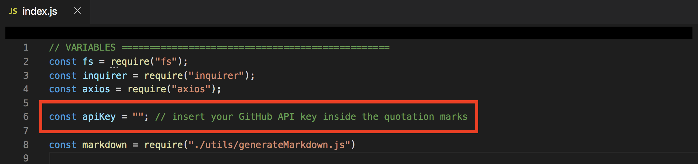

# Good GitHub README Generator
     

---

## Description:
a command-line application to generate a README markdown file for a GitHub project by collecting the user's input for their GitHub profile, repository data, and copyright information

---

## Table of Contents:
* [Installation](#installation)
* [Usage](#usage)
* [License](#license)
* [Contributing](#contributing)
* [Resources](#resources)
* [Tests](#tests)
* [Questions](#questions)

---

## Installation:
__step 1:__ clone this repository to your device; in your desired directory, enter the following in command-line:
```
git clone https://github.com/CrainDavis/READMEgenerator.git
```
__step 2:__ install the necessary npm packages by typing in the following command in the terminal:
```
npm install
```
__step 3:__ create a GitHub API access token at insert into the code
* follow the instructions on how to [get an API access token](https://help.github.com/en/github/authenticating-to-github/creating-a-personal-access-token-for-the-command-line) and make sure to check off the _"users"_ box to gain access to this information
* insert into code (in index.js on Line6)


---

## Usage:
__step 1:__ in the terminal, invoke the application with the following command:
```
node index.js
```
__step 2:__ answer the prompts for GitHub username, repository name, project title, and project description


* [another GIF link](https://drive.google.com/file/d/1aVHupjIQYec1aIxZPWpgR6WyWWicYoBJ)

__step 3:__ in your newly-generated README.md file, add other additional important information for each of the sections

---

## License:
[MIT License](https://opensource.org/licenses/MIT)

Copyright © 2020 Chyna Davis

Permission is hereby granted, free of charge, to any person obtaining a copy
of this software and associated documentation files (the "Software"), to deal
in the Software without restriction, including without limitation the rights
to use, copy, modify, merge, publish, distribute, sublicense, and/or sell
copies of the Software, and to permit persons to whom the Software is
furnished to do so, subject to the following conditions:

The above copyright notice and this permission notice shall be included in all
copies or substantial portions of the Software.

THE SOFTWARE IS PROVIDED "AS IS", WITHOUT WARRANTY OF ANY KIND, EXPRESS OR
IMPLIED, INCLUDING BUT NOT LIMITED TO THE WARRANTIES OF MERCHANTABILITY,
FITNESS FOR A PARTICULAR PURPOSE AND NONINFRINGEMENT. IN NO EVENT SHALL THE
AUTHORS OR COPYRIGHT HOLDERS BE LIABLE FOR ANY CLAIM, DAMAGES OR OTHER
LIABILITY, WHETHER IN AN ACTION OF CONTRACT, TORT OR OTHERWISE, ARISING FROM,
OUT OF OR IN CONNECTION WITH THE SOFTWARE OR THE USE OR OTHER DEALINGS IN THE
SOFTWARE.

---

## Contributing:
Contributor Covenant Code of Conduct
Our Pledge
We as members, contributors, and leaders pledge to make participation in our
community a harassment-free experience for everyone, regardless of age, body
size, visible or invisible disability, ethnicity, sex characteristics, gender
identity and expression, level of experience, education, socio-economic status,
nationality, personal appearance, race, religion, or sexual identity
and orientation.
We pledge to act and interact in ways that contribute to an open, welcoming,
diverse, inclusive, and healthy community.
Our Standards
Examples of behavior that contributes to a positive environment for our
community include:

* Demonstrating empathy and kindness toward other people
* Being respectful of differing opinions, viewpoints, and experiences
* Giving and gracefully accepting constructive feedback
* Accepting responsibility and apologizing to those affected by our mistakes,
and learning from the experience
* Focusing on what is best not just for us as individuals, but for the
overall community

Examples of unacceptable behavior include:

* The use of sexualized language or imagery, and sexual attention or
advances of any kind
* Trolling, insulting or derogatory comments, and personal or political attacks
* Public or private harassment
* Publishing others’ private information, such as a physical or email
address, without their explicit permission
* Other conduct which could reasonably be considered inappropriate in a
professional setting

Enforcement Responsibilities
Community leaders are responsible for clarifying and enforcing our standards of
acceptable behavior and will take appropriate and fair corrective action in
response to any behavior that they deem inappropriate, threatening, offensive,
or harmful.
Community leaders have the right and responsibility to remove, edit, or reject
comments, commits, code, wiki edits, issues, and other contributions that are
not aligned to this Code of Conduct, and will communicate reasons for moderation
decisions when appropriate.
Scope
This Code of Conduct applies within all community spaces, and also applies when
an individual is officially representing the community in public spaces.
Examples of representing our community include using an official e-mail address,
posting via an official social media account, or acting as an appointed
representative at an online or offline event.
Enforcement
Instances of abusive, harassing, or otherwise unacceptable behavior may be
reported to the community leaders responsible for enforcement at
[INSERT CONTACT METHOD].
All complaints will be reviewed and investigated promptly and fairly.
All community leaders are obligated to respect the privacy and security of the
reporter of any incident.
Enforcement Guidelines
Community leaders will follow these Community Impact Guidelines in determining
the consequences for any action they deem in violation of this Code of Conduct:
1. Correction
Community Impact: Use of inappropriate language or other behavior deemed
unprofessional or unwelcome in the community.
Consequence: A private, written warning from community leaders, providing
clarity around the nature of the violation and an explanation of why the
behavior was inappropriate. A public apology may be requested.
2. Warning
Community Impact: A violation through a single incident or series
of actions.
Consequence: A warning with consequences for continued behavior. No
interaction with the people involved, including unsolicited interaction with
those enforcing the Code of Conduct, for a specified period of time. This
includes avoiding interactions in community spaces as well as external channels
like social media. Violating these terms may lead to a temporary or
permanent ban.
3. Temporary Ban
Community Impact: A serious violation of community standards, including
sustained inappropriate behavior.
Consequence: A temporary ban from any sort of interaction or public
communication with the community for a specified period of time. No public or
private interaction with the people involved, including unsolicited interaction
with those enforcing the Code of Conduct, is allowed during this period.
Violating these terms may lead to a permanent ban.
4. Permanent Ban
Community Impact: Demonstrating a pattern of violation of community
standards, including sustained inappropriate behavior,  harassment of an
individual, or aggression toward or disparagement of classes of individuals.
Consequence: A permanent ban from any sort of public interaction within
the community.
Attribution
This Code of Conduct is adapted from the Contributor Covenant,
version 2.0, available at
https://www.contributor-covenant.org/version/2/0/code_of_conduct.html.
Community Impact Guidelines were inspired by Mozilla’s code of conduct
enforcement ladder.
For answers to common questions about this code of conduct, see the FAQ at
https://www.contributor-covenant.org/faq. Translations are available at
https://www.contributor-covenant.org/translations.

---

## Resources:
* [npm.js packages](https://www.npmjs.com/)
    * [FileSystem (fs)](https://www.npmjs.com/package/fs)
    * [axios](https://www.npmjs.com/package/axios)
    * [inquirer](https://www.npmjs.com/package/inquirer)

---

## Tests:

---

## Questions: 
for any questions, please contact:

 

__[CrainDavis](https://github.com/CrainDavis)__ at chyna.davis11@gmail.com
